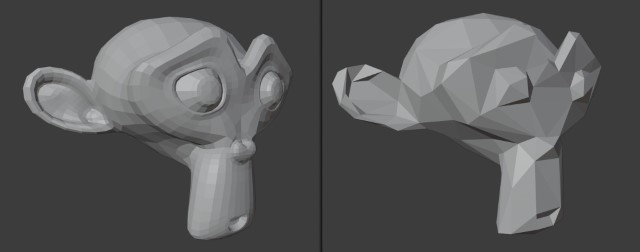

  

# Lowpolyzer
A Blender addon to apply a low poly style to your objects

## Install
1. Download the latest zip in the releases page
2. In Blender, install the zipped addon in the preferences window

## Usage

Lowpolyze your objects by going to Object > Transform > Lowpolyze

  

This can be applied to multiple selected objects.

By the nature of the remesh modifier, the operation can take a few seconds to complete.

## How does it work?
This addon adds 2 modifiers for each object you have selected:
- Remesh modifier
- Decimate modifier

The remesh modifier is used to remesh whole objects, 
while the decimate modifier will reduce significantly the geometry detail.

## Limitations

Due to the remesh modifier, any material applied on specific faces will be lost. 
This is because the remesh modifier recalculates all faces and will not keep previous face data.